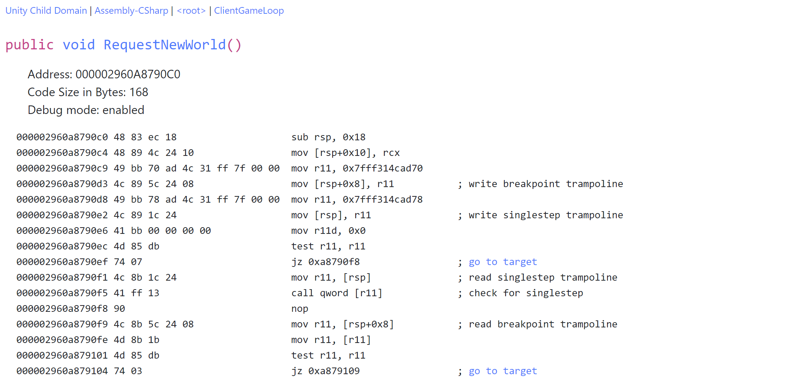

# Contents
This package contains a bunch of different tools for poking around in Unity. The most prominent ones are:
 - Asm Explorer: A tool to view the assembly code generated by the Mono JIT,
 - Screw It! Profiler: A sampling-profiler for Unity that understands Mono
Scroll down for more explanations

## Setup
Copy the package `Packages/com.s-schoener.asmexplorer` from this project into your project's package folder. You may have to install a recent version of Burst/Jobs/collections; the dependencies aren't properly setup yet.

# Asm Explorer
The `AsmExplorer` package allows you to take a look at the code generated by the JIT compiler of the Mono version included in Unity. It has been tested with Unity 2019.3 but may well work with other versions of Unity. (You may have to change the name of the Mono DLL for the PInvokes to `mono.dll` for older versions that still use the .NET 3.5 runtime.)

## Usage
To use this tool, import the package into your Unity project. The easiest way to do that is to go to the `Packages` folder and copy `com.s-schoener.asmexplorer` to the `Packages` folder of your Unity project.

### In the editor
Click on `Window/Asm Explorer` and find whatever you are interested in.

### In the player
Place the `AsmExplorerHelper` mono behavior on a object in your scene. This will start the webservice that allows you to explore your assemblies and the code generated by the JIT compiler.

Now point the browser of your choice to `http://localhost:8080/explorer/` (the last slash is absolutely necessary) and use the interface to navigate to the method of your choice to inspect its generated x86/x64 assembly code.

## Caution
Make sure that you are aware of the mode that the code you see is generated in. The tool works from inside the editor as well, but the code generated there will obviously be less optimized. To see fully optimized code (well, to the extent that the Mono 2.6 compiler optimizes the code at least...), make sure to create a non-development build of your game and inspect the code using that build.

## Known issues
 * The web interface is slow. Yes, I know; but that's not the point of this whole thing. Adding caching and some obvious optimizations to the webservice is left as an exercise to the reader.
 * Everything breaks apart when you miss the final `/` in the webservice's URL. There is probably a very simple fix for this but I wanted to get this out sooner rather than later :)
 * The code could use a clean up. I'm aware of this but don't know when I will find the time to fix this problem. It's good enough for a program hacked into being in two days :)

# Screw It! Profiler
Screw It! is a sampling profiler for Unity on Windows. It's basically a glorified front-end for `xperf` that helps resolving Mono jitted functions. There are a few caveats:
 * it currently only works in the editor,
 * it does not support domain reloads,
 * it only shows samples from `Unity.exe`,
 * it's really for the use case of running it for 30-60 seconds.

## Usage
Open the profiler from `Window/Asm Explorer/Profiler`. Click the `Record` button in the top-left to start/stop recording or load an existing trace. Starting a recording will ask you for administrator privileges (twice) to run `xperf` to set the sampling frequency and actually do the sampling. Note that triggering a domain-reload will automatically stop the profiling. Enter playmode first, then start sampling.

Once it's done, the trace should be automatically loaded. Use the dropdown in the top-right to switch to different views. The available views are:
 * Function HeatMap: see the number of samples per function; use `Reattribute Kernel Samples` to attribute any samples in a kernel function to its caller.
 * Top-Down View: A top down view of the samples in the trace with their callstacks
 * Hot Subtree view: Enter a search string for a function in the top-right and click update. You will see all samples whose stack trace includes any function that contains the search string, split up by function. This is helpful when you know that a subtree is problematic, but it is very branchy and you just want to split the samples by function and ignore the tree-structure.

## Known issues
 * Sometimes unrelated kernel callstacks appear below certain functions, but it's only for relatively few samples

# License
The code is licensed under a MIT license and is using SharpDisasm under the Simplified BSD license.
